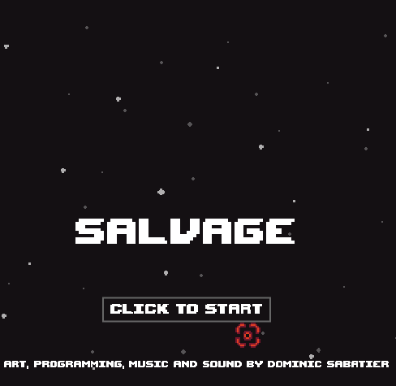
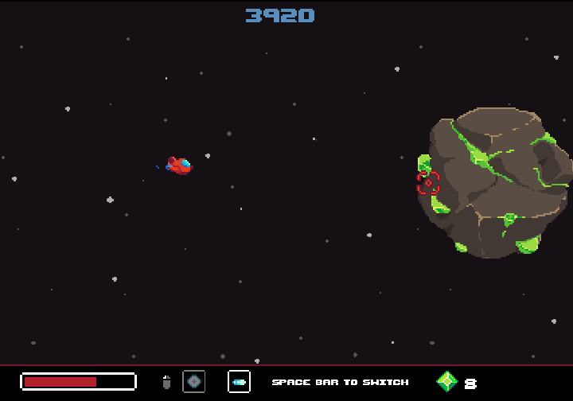

[Play on Itch.io](https://dsabatier.itch.io/salvagejs)
[Play on this site](https://dsabatier.github.io/SalvageJS/)

SalvageJS is a small prototype built to explore HTML5 and the Phaser3 JavaScript framework.  All art, music, sound effects and programming was done solo over some evenings and weekends June and July 2020.  Art was made using Asesprite, music in Bosca Ceiol, sound effects in SFXR and BFXR and coding done in Visual Studio Code.

